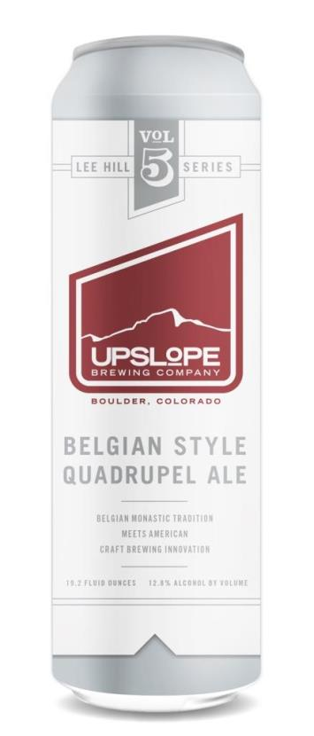

```{r setup, include=FALSE}
knitr::opts_chunk$set(echo = TRUE)
```

*Though enjoying a quality craft beer is simple enough to do, brewing it to perfection is quite another story. It can take years of effort and lots of batches of beer to create a delicious brew. The more you understand about the beer you are drinking, the more you can fully appreciate it in all of its glory.*

*Two important measurements of beer that you should know are ABV and IBU. Figuring out what they mean and how they relate to beer can help you to better understand our analysis below and your own preference for beer and the beers behind the bar.*


### What Does ABV Mean?
ABV stands for Alcohol By Volume and is usually listed as a percentage. By law in the United States, the ABV must be listed on each beer to give customers an idea about how much alcohol is in each brew. 

This percentage lets you know how much of your beer is alcohol and how much is other stuff, like water. Simply put, the higher the ABV, the more drunk you'll get. Beer can be anywhere between 2% to 12% ABV, though you'll generally find it in the 4% to 6% range. 

So how does a beer become alcoholic? During the brewing process, yeast transforms sugar into alcohol. Brewers take samples of the beer while its undergoing this process, and make changes to the batch in order to make it as strong as they'd like.

### What Does IBU Mean?
Like ABV, IBU (International Bitterness Units) is another common measurement for beer. Rather than telling us how much alcohol there is, IBU measures the bitterness from hops in a beer on a scale of 0 to 100. In more technical terms, IBU gauges the isomerized alpha acids from hops in a beer in parts per million. Very hoppy beers, like imperial IPAs, can reach 80 BU. 

Though IBUs can help you better understand what type of beer you like in terms of bitterness, it's important to note that the bitterness of beer is also affected by malts. Beer with a high IBU, like stouts, might not taste very bitter at all because of their sweet malts. Instead of relying on IBU to perceive the bitterness of a beer, use it to gauge your preferences. Try to look at the IBU of your favorite beers to understand what range is your favorite.

***http://berghoffbeer.com

# Case Study 1

### How many breweries are present in each state?
Following code generates a data file that represents the total no. of breweries present in each state (US Specifically).
```{r}
#import breweries file
Breweries <- read.csv("data/Breweries.csv")
#inspecting the dataset
str(Breweries)
#sort the data by state
library(dplyr)
breweriesOrderedByState <- arrange(Breweries, desc(Breweries$State))
# use table function to get a count of breweries
breweriesbystate <- table(Breweries$State)
# change table to dataframe
breweriesbystate <- as.data.frame(breweriesbystate)
str(breweriesbystate)
# assign names to columns
names(breweriesbystate) <- c("State","Total Breweries")
print(breweriesbystate)
```
Observed that the state of Colorado has the highest number of breweries followed by California. Also, the least number of breweries are present in four states, District of Columbia, North Dakota, South Dakota and West Virginia

###  Merge beer data with the breweries data. Print the first 6 observations and the last six observations to check the merged file.

Following code generates a merged data file for the breweries and the beers available in them

```{r}
#load the beers file
Beers <- read.csv("data/Beers.csv")
# inspect dataset
str(Beers)
names(Breweries) 
names(Beers) 
#rename columns
names(Breweries) <- c("Brewery_id","Brewery_Name", "City", "State" )
names(Beers) <- c("Beer_Name","Beer_ID","ABV","IBU","Brewery_id","Style","Ounces") 
#common variable data is Brewery_id
breweriesandbeers <- merge(Breweries,Beers, by=c("Brewery_id"), all=TRUE)
str(breweriesandbeers) # 2410 10
head(breweriesandbeers)
tail(breweriesandbeers)
write.csv(breweriesandbeers,file ="data/breweriesandbeers.csv", row.names = FALSE, quote=FALSE)

```
Note that the file generated is located under the "data" subdirectory. Based on the first and last six rows of the merged file, this dataset contains the list of the beers available in each of the breweries sorted by state

### Report the number of `NA's` In each column.

```{r}
#variable NA_count will represent the number of NA's in each column
NA_count <- colSums(is.na(breweriesandbeers))
NA_count
```
The number of NA's in the column ABV: 62, IBU: 1005, the rest columns: 0.

### Which state has the maximum alcoholic (ABV) beer? Which state has the most bitter (IBU) beer?

```{r}
#Lets move NAs from the ABV column and then check max ABV using function order (we want to see the whole line which contains this element)
#Variable ABV_NOna will represent data set without NAs elements in the column ABV and ABV_NOna_ordered will represent ordered data set by column ABV without NAs elements. 
ABV_NOna <- subset(x=breweriesandbeers, !is.na(breweriesandbeers$ABV))
ABV_NOna_ordered <- ABV_NOna[order(ABV_NOna$ABV),]
tail(ABV_NOna_ordered,1)
#Lets move NAs from the IBU column and then check max IBU using function order (we want to see the whole line which contains this element)
#Variable IBU_NOna will represent data set without NAs elements in the column IBU
IBU_NOna <- subset(x=breweriesandbeers, !is.na(breweriesandbeers$IBU))
IBU_NOna_ordered <- IBU_NOna[order(IBU_NOna$IBU),]
tail(IBU_NOna_ordered,1)
#In this way we gave the answer on the question 5 and still keeping all NAs in final dataset "breweriesandbeers" in case we will need them.
```
Based on data we have State Colorado (CO) has the maximum alcoholic (Lee Hill Series Vol. 5 - Belgian Style Quadrupel Ale: ABV = 0.128) beer. State Oregon (OR) has the most bitter (Bitter Bitch Imperial IPA: IBU = 138) beer.

[](https://www.upslopebrewing.com/lee-hill-series-vol-5-belgian-style-quadrupel-ale/)[](http://beerguypdx.blogspot.com/2013/05/astoria-brewing-company-bitter-bitch.html)

[*Interesting: Samuel Adams claims the title of brewing the strongest naturally-fermented beer in the world. In 2012, Utopia was released at 29% ABV (58 proof), though some of its barrels clocked in at 33% ABV. Yes, you read that right.Location: Massachusetts, United States*](http://berghoffbeer.com/blog/5-strongest-naturally-fermented-beers-world/)

### Compute the median alcohol content and international bitterness unit for each state. Plot a bar chart to compare.

```{r}
med.abv <- tapply(ABV_NOna$ABV, ABV_NOna$State, median)
med.abv
med.ibu <- tapply(IBU_NOna$IBU, IBU_NOna$State, median)
med.ibu
barplot(med.abv)
barplot(med.ibu)
```


### Summary statistics for the ABV variable.

Here we examine a summary  of the ABV data in our `Beers.csv` dataset.
```{r}
summary(breweriesandbeers$ABV)
```
Min. ABV is 0.001, Mean value is 0.05977 and Max. ABV is 0.128.

### Is there an apparent relationship between the bitterness of the beer and its alcoholic content?

In order for us to better examine whether or not there is a relationship betwen the bitterness of the beer and its alcoholic content we will take a look at
the `ABV` and `IBU` data. The `ABV` data represents our alchol volume measurement within the beer itself, and the `IBU` represents the international bitterness
measurement of the beer. Before we can plot these we must create a subset of this data set.

```{r}
#create a subset for the variables ABV and IBU as they are our variables fo interest
bitter_vs_alc <- subset(Beers, subset = is.na(IBU) == FALSE, select = c(ABV, IBU))

head(bitter_vs_alc)
```


Now that we have prepared our data we will plot it to better understand the relationship.

```{r}
library(ggplot2)

ggplot(data=bitter_vs_alc, aes(x=ABV, y=IBU)) +
  geom_point(pch = 20, color = "brown", size=2) +
  geom_smooth(method="lm", color="red", linetype=2) +
  labs(title="Alcoholic Content vs Bitterness",
       x="Alcohol by Volume", y="International Bitterness Units")
```

Based on our chart above we can conclude that there is a positive relationship between the alchol content and bitterness units based on our line present through the graph. We can also see that as bitterness increases we also expect to see an increase in the alchol levels. This suggests that if a beer has a bitter taste, the alchol content could be high for that specific beer.

Lets check correlation value using next code:
```{r}
cor.test(breweriesandbeers$ABV,breweriesandbeers$IBU)
```
p-value < 2.2e-16 means we should reject the null hypothesis that true correlation is equal to 0. We can conclude that alcoholic content (ABV) and bitterness (IBU) are significantly correlated with a correlation coefficient of 0.67 and p-value of 2.2*10^{-16}.
